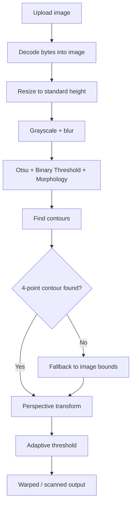

# BukaCV Document Scanner

Small Flask API for image preprocessing (grayscale, contour detection, warp, lighten) and PDF export.

## Endpoints
- `POST /grayscale` - returns grayscale PNG
- `POST /contours` - returns PNG with detected contour
- `POST /warp` - returns warped (scanned) PNG
- `POST /lighten` - returns lightened PNG
- `POST /pdf` - returns PDF

## How the Document Scanning works

All endpoints expect `multipart/form-data` with a file field named `image`.
